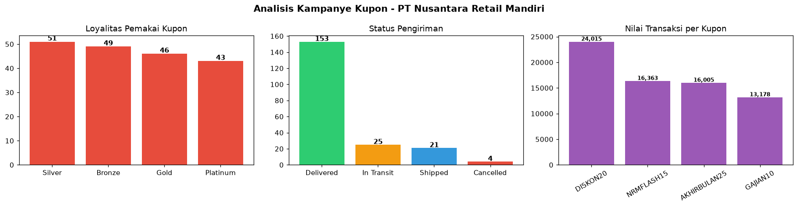

# Tugas 1 — Data Wrangling

    

> ETL pipeline multi-sumber: CSV + SQL + REST API → `df_master_analisis`

**Muhammad Adam Hasani** · NIM 25200013

---

## Ringkasan

| | |
|---|---|
| **Peran** | Associate Data Engineer / Data Wrangler — PT Nusantara Retail Mandiri |
| **Permintaan** | Head of Business Strategy (Data Owner) |
| **Tujuan** | Analisis performa kampanye kupon diskon: volume transaksi, profil loyalitas, status pengiriman |
| **Tantangan** | Data tersebar di 3 departemen, 3 format berbeda (CSV / SQL / JSON API) |
| **Solusi** | Pipeline ekstraksi → validasi → integrasi → kamus data otomatis |

## Arsitektur Pipeline

```
┌─────────────┐     ┌──────────────────┐     ┌───────────────────┐
│  CSV (POS)  │     │  SQLite (CRM)    │     │  REST API         │
│  transaksi  │     │  pelanggan       │     │  status kirim     │
└──────┬──────┘     └────────┬─────────┘     └─────────┬─────────┘
       │ read_csv            │ sqlalchemy              │ requests +
       │ parse_dates+dtype   │ WHERE is_active=1       │ json_normalize
       ▼                     ▼                         ▼
┌─────────────────────────────────────────────────────────────────┐
│         dedup → MERGE (LEFT JOIN) → df_master_analisis          │
└──────┬──────────────────────┬───────────────────────┬───────────┘
       ▼                      ▼                       ▼
  analisis kupon        generate_data_dictionary   assert × 3
```

## Dataset

| Sumber | Format | Skala | Catatan |
|---|---|---|---|
| Transaksi POS | CSV | 80,000 baris · 4,005 invoice · 2,832 produk · 1,904 pelanggan · 30 negara | Basis: [UCI Online Retail](https://archive.ics.uci.edu/dataset/352/online+retail); periode Des 2010 – Mar 2011 |
| CRM | SQLite | 1,904 pelanggan, 4 tier membership | Kolom `is_active` untuk filter pelanggan aktif |
| Logistik | JSON (mock REST) | 4,005 shipment, JSON bersarang 3 tingkat | Di-host di repo ini via raw URL, fallback lokal |

Kampanye kupon yang dianalisis: `AKHIRBULAN25` (25%), `DISKON20` (20%), `NRMFLASH15` (15%), `GAJIAN10` (10%)



## Keputusan Desain

| Keputusan | Alasan |
|---|---|
| **LEFT JOIN** POS→logistik | Order tanpa record kirim (belum diproses) tetap terhitung; INNER JOIN memicu undercount penjualan |
| **LEFT JOIN** →CRM | CRM sudah difilter `is_active=1`; INNER di sini membuang transaksi pelanggan non-aktif yang secara bisnis tetap nyata |
| **Dedup sebelum merge** | API level order vs POS level item — tanpa dedup, join menggandakan baris |
| **SQLite**, bukan server DB | Zero-infra, file ikut deliverable, reproducible di mesin siapa pun |
| **dtype override `InvoiceNo`** | Mencegah pandas mengonversi ke numeric dan merusak leading zero |

## Hasil Analisis

| Metrik | Nilai |
|---|---|
| Total invoice pakai kupon | **203** |
| Total nilai transaksi kupon | **68,949.57** |
| Tingkat terkirim | **75.4%** (153/203) |

```
Loyalitas pemakai kupon        Status pengiriman
Silver     ██████████ 51       Delivered   ██████████████ 153
Bronze     █████████  49       In Transit  ██ 25
Gold       ████████   46       Shipped     █ 21
Platinum   ███████    43       Cancelled   ▏ 4

Nilai transaksi per kode kupon
DISKON20       ████████████████████ 24,015
NRMFLASH15     █████████████ 16,363
AKHIRBULAN25   █████████████ 16,005
GAJIAN10       ██████████ 13,178
```

## Data Quality Gate

Semua assertions lolos sebelum dataframe dinyatakan siap analisis:

```python
assert df.duplicated(subset=['InvoiceNo','StockCode']).sum() == 0   # integritas PK
assert (df['total_amount'] >= 0).all()                              # domain nilai
assert (df['InvoiceDate'] <= pd.Timestamp.now()).all()              # temporal sanity
```

Data dictionary dihasilkan otomatis oleh `generate_data_dictionary()` — metadata per kolom (dtype, missing %, kardinalitas, sampel nilai) diekspor ke `kamus_data_hasil.csv`.

## Struktur Repository

| File | Keterangan |
|---|---|
| `Tugas1_DW_25200013.ipynb` | Notebook utama — full run, outputs lengkap |
| `transaksi_pos_nrm.csv` | 80,000 baris transaksi POS |
| `customers_nrm.db` | SQLite — 1,904 pelanggan CRM |
| `status_pengiriman.json` | Mock REST API logistik — 4,005 shipment |
| `kamus_data_hasil.csv` | Output data dictionary otomatis |

## Reproducibility

```bash
# upload ke Google Colab / Jupyter, lalu Run All
# notebook fetch data logistik dari raw URL repo ini,
# fallback otomatis ke file lokal jika offline
```

Dependencies: `pandas`, `numpy`, `sqlalchemy`, `requests` — semuanya pre-installed di Colab.

---

*Data Wrangling · 25200013 — Muhammad Adam Hasani*
